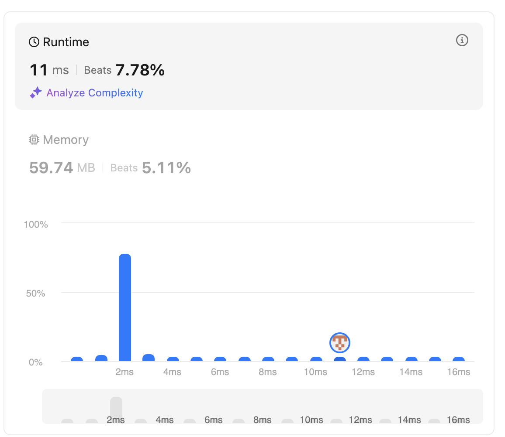

# first trial
- complexity

```java
class Solution {
    public boolean lemonadeChange(int[] bills) {
        List<Integer> changeTypes = List.of(20,10,5);
        int remonadePrice = 5;
        // the changes should be less than equal amount of available
        // if not early return false
        Map<Integer, Integer> changeToAmount = new HashMap<>();
        for(int type: changeTypes){
            changeToAmount.put(type, 0);
        }

        for(int bill: bills){
            if(bill == remonadePrice){
                changeToAmount.put(bill, changeToAmount.get(bill)+1);
            } else {
                int change = bill-remonadePrice;
                // check bigger to smaller
                for(int type: changeTypes){
                    if(change >= type){
                        while(change - type >= 0 && changeToAmount.get(type) > 0){
                            change -= type;
                            changeToAmount.put(type, changeToAmount.get(type)-1); 
                        }
                    }
                }
                
                if(change == 0){
                    changeToAmount.put(bill, changeToAmount.get(bill)+1);
                }
                if(change != 0){
                    return false;
                } 
            }
        }
        
        
        return true;
    }
}
```