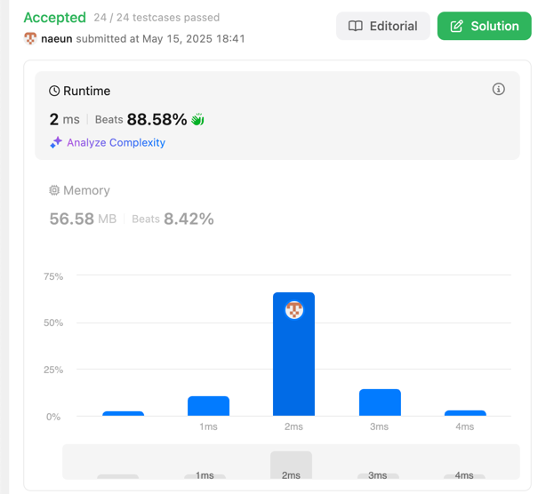

- Question: [238. Product of Array Except Self](https://leetcode.com/problems/product-of-array-except-self/)
# Solution
## idea
- have to product except itself
- product from left / itself / product from right
- there would be 2 arrays one of which is product from left and the other is product from right
- To handle with first and last index, use extended array with number 1
  - number 1 has same meaning as do nothing when multiply
## example with given nums in question
```text
- nums : [1, 2, 3, 4]
- result: [2*3*4, 1*3*4, 1*2*4, 1*2*3] = [24, 12, 8, 6]
- product fromLeft: [1, 1*2, 1*2*3, 1*2*3*4]
    - with extension: [1, 1, 1*2, 1*2*3, 1*2*3*4, 1]
- product fromRight: [4*3*2*1, 4*3*2, 4*3, 4]
    - with extension: [1, 4*3*2*1, 4*3*2, 4*3, 4, 1]
```
| num index| fromLeft index (value)| fromRight index (value)| result|
|---|---|---|---|
| 0 | _ | 1 (4*3*2) | 24 |
| 1 | 0 (1) | 2 (4*3) | 12 |
| 2 | 1 (1*2) | 3 (4) | 8 |
| 3 | 2 (1*2*3) | _ | 6 |

## Complextiy

- time complexity: O(n)
- space complexity: O(1)

## Code
```java
class Solution {
    public int[] productExceptSelf(int[] nums) {

        int extendedLength = nums.length+2;
        int[] fromLeft = new int[extendedLength];
        fromLeft[0] = 1;
        fromLeft[extendedLength-1] = 1;
        for(int i = 0; i < nums.length; i++){
            fromLeft[i+1] = fromLeft[i] * nums[i];
        }

        int[] fromRight = new int[extendedLength];
        fromRight[0] = 1;
        fromRight[extendedLength-1] = 1;
        for(int i = nums.length-1; i >=0; i--){
            fromRight[i+1] = nums[i] * fromRight[i+2];
        }

        int[] result = new int[nums.length];
        for(int i = 0; i < nums.length; i++){
            result[i] = fromLeft[i] * fromRight[i+2];
        }

        return result;
    }
}
```