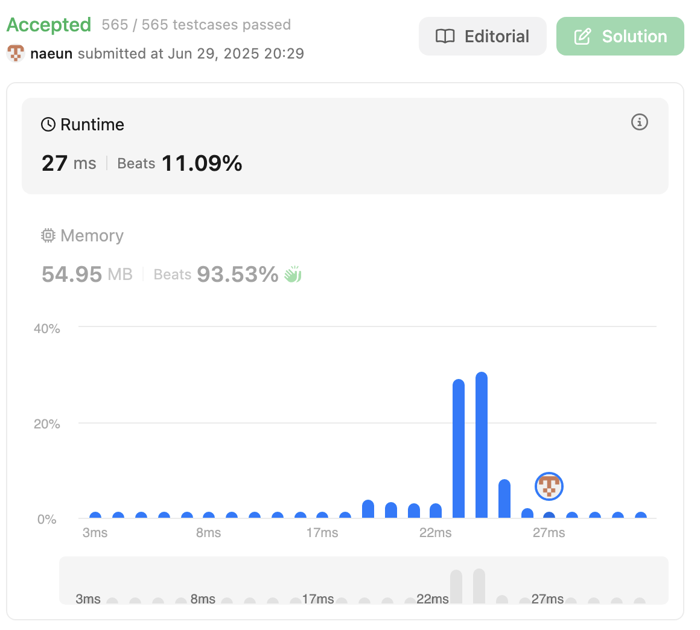

# Solution
- [question](https://leetcode.com/problems/contiguous-array/)
- First, tried to solve it with left and right index -> failed.
- Then, saw hints

## Idea
1. iterate once (index could be right index) and then store pre-sum in hashmap(key: sum, value: index). In this case, 0 should be -1 and 1 should be 1.
- If pre-sum is zero -> it means match condition. Therefore, update answer. This means that [0, now] matches condition. 
- value of hashmap would be the highest index.
2. iterate once again(this could be left index).
- calculate pre-sum again.
- The value of hashmap pre-sum means that [now, rightIndex] matches condition.

## Code
```java
class Solution {
    // ex: [-1,0,1,2,3,4,3,2,1]
    public int findMaxLength(int[] nums) {
        // 0 -> -1
        // 1 -> 1
        // if sum is zero -> it's match condition
        Map<Integer, Integer> sumIndex = new HashMap<>();
        int sum = 0;
        int answer = 0;
        for(int i = 0 ; i < nums.length; i++){
            if(nums[i] == 0){
                sum--;
            } else {
                sum++;
            }
            if(sum == 0){
                answer = i+1;
            }
            sumIndex.put(sum, i);
        }

        sum = 0;
        for(int left = 0; left < nums.length; left++){
            if(nums[left] == 0){
                sum--;
            } else {
                sum++;
            }

            answer = Math.max(answer, sumIndex.get(sum) - left);
        }

        return answer;
    }
}
```

## Complexity

- Time: O(n)
- Space: O(n)

# Other's solution
## Code
- problem could be solved with one iteration.
```java
class Solution {
    public int findMaxLength(int[] nums) {
        HashMap<Integer, Integer> map = new HashMap<>();
        map.put(0, -1);
        int maxLen = 0;
        int sum = 0;
        for(int i = 0; i < nums.length; i++){
            sum = sum + ((nums[i]==0)? -1 : 1);
            if(map.containsKey(sum)){
                int len = i - map.get(sum);
                maxLen = Math.max(maxLen, len);
            } else{
                map.put(sum,i);
            }
        }
        return maxLen;
    }
}
```

# With GPT
## Better expression
1. First, iterate through the array while computing the prefix sum.  
   - Treat 0 as -1 and 1 as +1.  
   - Use a hashmap to store the *rightmost index* for each prefix sum encountered (key: sum, value: index).  
   - If the prefix sum becomes 0 at any point, it means the subarray from index 0 to the current index is valid, so update the answer accordingly.

2. Then, iterate again using the left index.  
   - Recompute the prefix sum from the beginning.  
   - For each prefix sum, if it exists in the map, the value (i.e., the rightmost index where the same prefix sum occurred) indicates a subarray `[left, right]` with equal number of 0s and 1s.  
   - Update the answer with the length of this subarray.
