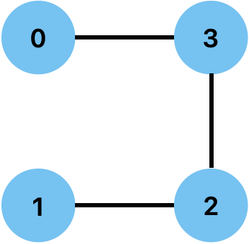

# Question
[547. Number of Provinces](https://leetcode.com/problems/number-of-provinces/)

# Idea
Find the total number of connected components in an undirected graph.
>  Use Union-Find.

# First Try
- Implemented only the `union` method.

```swift
class Solution {
    func findCircleNum(_ isConnected: [[Int]]) -> Int {
        let citiesCount = isConnected.count
        var roots = Array(0..<citiesCount)

        func union(_ first: Int, _ second: Int) {
            if isConnected[first][second] == 1 {
                let firstRoot = roots[first]
                let secondRoot = roots[second]

                if firstRoot != secondRoot {
                    roots[second] = firstRoot
                }
            }
        }

        for first in 0..<citiesCount {
            for second in (first + 1)..<citiesCount {
                union(first, second)
            }
        }

        let provincesCount = Set(roots).count
        return provincesCount
    }
}
```

However, this case fails:
isConnected = [[1,0,0,1],[0,1,1,0],[0,1,1,1],[1,0,1,1]]

Expected roots = [0,0,0,0]
Actual roots = [0,1,0,0]
because, the root is not fully updated.


# Second Try
- Added `find` method to search the actual root of each city.

```swift
class Solution {
    func findCircleNum(_ isConnected: [[Int]]) -> Int {
        let citiesCount = isConnected.count
        var roots = Array(0..<citiesCount)

        func find(_ city: Int) -> Int {
            if roots[city] != city {
                roots[city] = find(roots[city])
            }
            return roots[city]
        }

        func union(_ first: Int, _ second: Int) {
            if isConnected[first][second] == 1 {
                let firstRoot = find(first)
                let secondRoot = find(second)

                if firstRoot != secondRoot {
                    roots[secondRoot] = firstRoot
                }
            }
        }

        for first in 0..<citiesCount {
            for second in (first + 1)..<citiesCount {
                union(first, second)
            }
        }

        let provincesCount = Set(roots.map { find($0)}).count
        return provincesCount
    }
}
```

# Complexity
- Time: O(N^2)
- Space: O(N)
