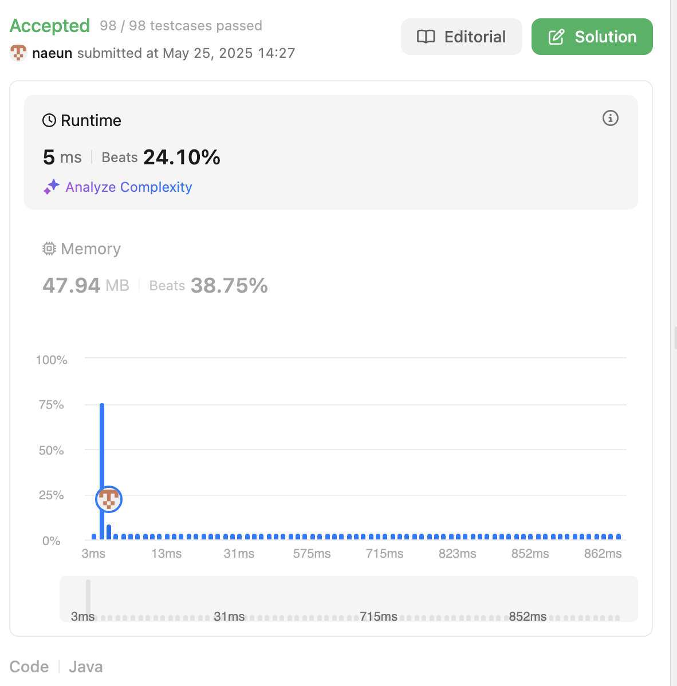

# First Solution
## Idea
- match condition: product < k
- while increasing right,
    - if match condition
        - length of left~right can be all accepted
        - for example
        ```text
        [10, 3, 2] is accepted -> [3,2], [2] also can be accepted
        length of left~right contains cases of [10,3,2] [3,2] [2]
        ```
        - move to next right
    - else(not match condition)
        - while equalAndGreater than k
            - increase left 
            - if match condition -> count length of indexes
            - for example
            ```text
            [3, 2, 5] is accepted -> [2,5], [5] also can be accepted
            length of left~right contains cases of [3, 2, 5] [2,5] [5]
            ```
## Complexity
- Time complexity: O(n) - iterate nums twice
- Space: O(1) - using some fields with updating

## Code
```java
class Solution {
    public int numSubarrayProductLessThanK(int[] nums, int k) {
        // left // right
        int result = 0;
        int left = 0;
        long product = 1;
        for(int right = 0; right<nums.length; right++){
            product *= nums[right];
            if(product < k){
                result += right-left+1; 
            } else {
                while(product >= k && left < right){
                    product /= nums[left];
                    left++; 
                    if(product < k){
                        result += right-left+1;
                    }
                }
            }
        }

        return result;
    }
}
```